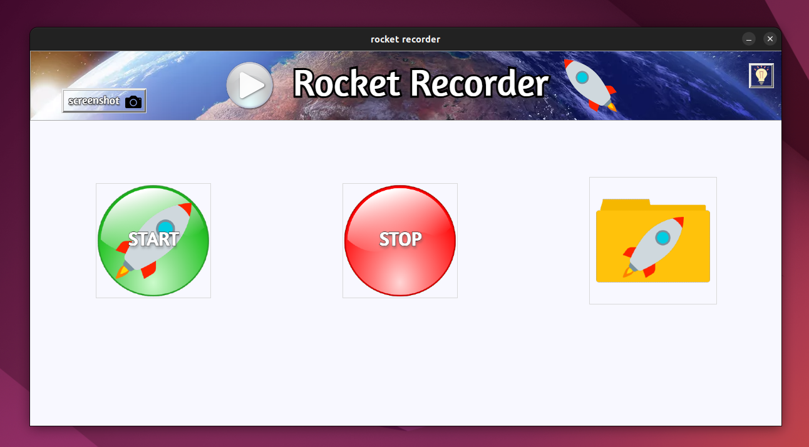

<div align="center">


# Rocket Recorder



[](https://www.youtube.com/watch?v=NkbS3nXG1xM)

# How to run a project:

## The first way:

### Cloning the repository

--> Clone the repository using the command below :

```bash
git clone https://github.com/YuriiDorosh/Rocket-Recorder.git

```

--> Move into the directory where we have the project files :

```bash
cd Rocket-Recorder

```

--> Create a virtual environment :

```bash
# Let's install virtualenv first(Linux)
sudo apt-get install python3-venv 

# Then we create our virtual environment
# Linux:
python3 -m venv venv
# Windows:
python -m venv venv

```

--> Activate the virtual environment :

```bash
# Windows
venv\scripts\activate
# Linux
source venv/bin/activate

```

--> Install the requirements :

```bash
# Linux:
pip3 install -r requirements.txt
# Windows:
pip install -r requirements.txt
```

--> Project launch :
```bash
# Linux:
cd ..
python3 Rocket-Recorder
# Windows:
cd ..
python Rocket-Recorder
```

## The second way:

### check if you are in the project folder
#### Linux:
--> right click and open terminal

or

--> ctrl + alt + t and open the directory with the project
```bash
chmod +x run.sh

run.sh
```
#### Windows:
--> right click and open cmd or PowerShell
```bash
run.bat
```

## The third way:
#### (temporarily only for Linux)

--> Install Docker :
```bash
sudo apt install docker.io
sudo apt-get install x11-xserver-utils
```

--> Verify that Docker is installed correctly :
```bash
# If the version is displayed - success!!!
docker --version
```

--> Build image :
```bash
sudo docker build -t 123:latest .
```

--> Run a Docker container :
```bash
sudo docker run -it --privileged -e DISPLAY=$DISPLAY -v /tmp/.X11-unix:/tmp/.X11-unix -v "$(pwd)":/app continuumio/miniconda3 python3 /app/__main__.py
```


## Request

#### This project may contain bugs.
#### Please contact my on Telegram:
#### @s11nd8r 
 or 
#### @y_u_r_a111

#
#
P.S. I look forward to Your pull requests :)

